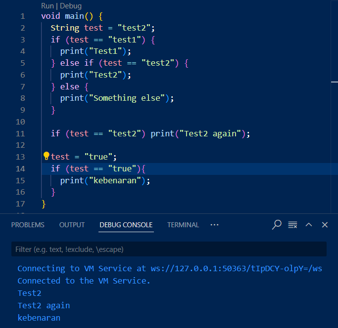
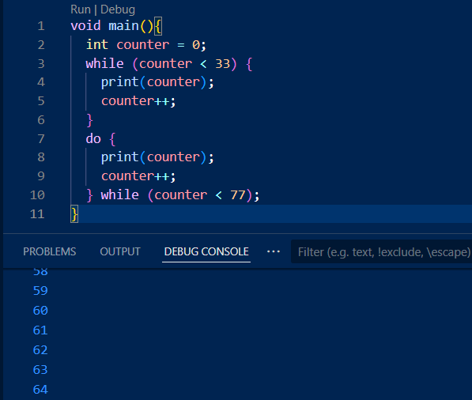
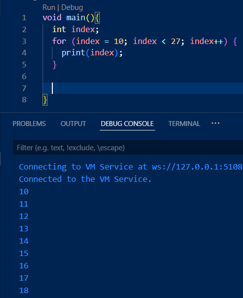
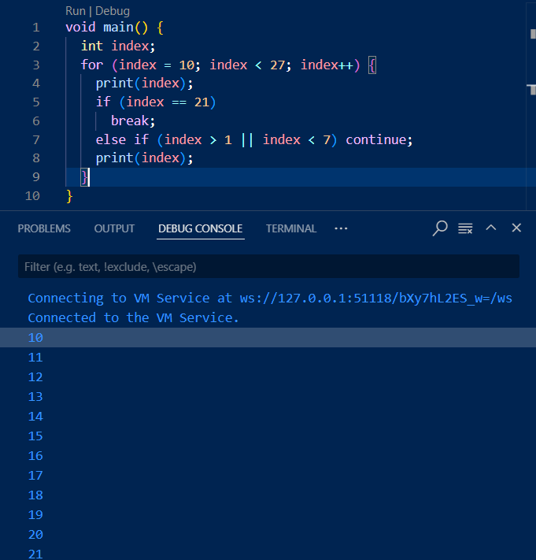
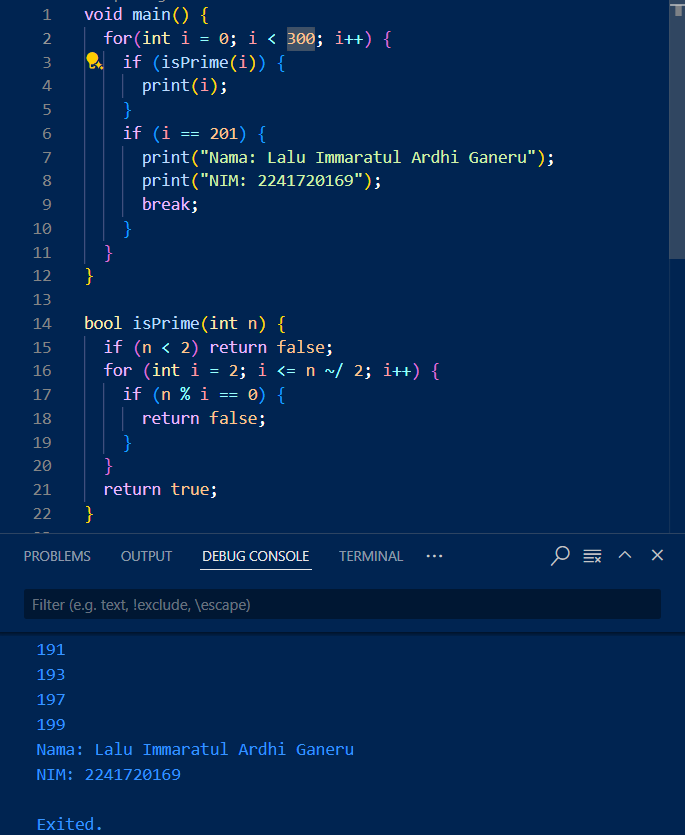

1. Silakan selesaikan Praktikum 1 sampai 3, lalu dokumentasikan berupa screenshot hasil pekerjaan beserta penjelasannya!
    Praktikum 1
    
    pada if yang pertama, karena nilai dari test adalah test2 maka output adalah "test2". Begitu juga pada if yang ke-2, karena test masih bernilai "test2" output nya adalah "Test2 again". pada bagian terakhir, nilai test dirubah menjadi "true" sehingga menghasilkan output "kebenaran"
    Praktikum 2
    
    pada perulangan yang pertama, program melakukan pengecekan terlebih dahulu untuk mengetahui apakah counter lebih kecil dari 33. Jika counter lebih kecil dari 33, maka program akan mencetak nilai counter (0-32) dan menambahkan nilai counter. pada perulangan kedua, program mencetak nilai counter (33-76) dan menambahkannya terlebih dahulu, lalu mengecek kondisi bahwa counter harus lebih kecil dari 77.
    Praktikum 3
    
    Pada percobaan diatas, program akan mengeluarkan nilai index (10-26) selama index bernilai kurang dari 27
    
    pada percobaan kedua, dengan penambahan kode, program akan berhenti saat index bernilai sama dengan 21 karena ada break
2. Buatlah sebuah program yang dapat menampilkan bilangan prima dari angka 0 sampai 201 menggunakan Dart. Ketika bilangan prima ditemukan, maka tampilkan nama lengkap dan NIM Anda.
    