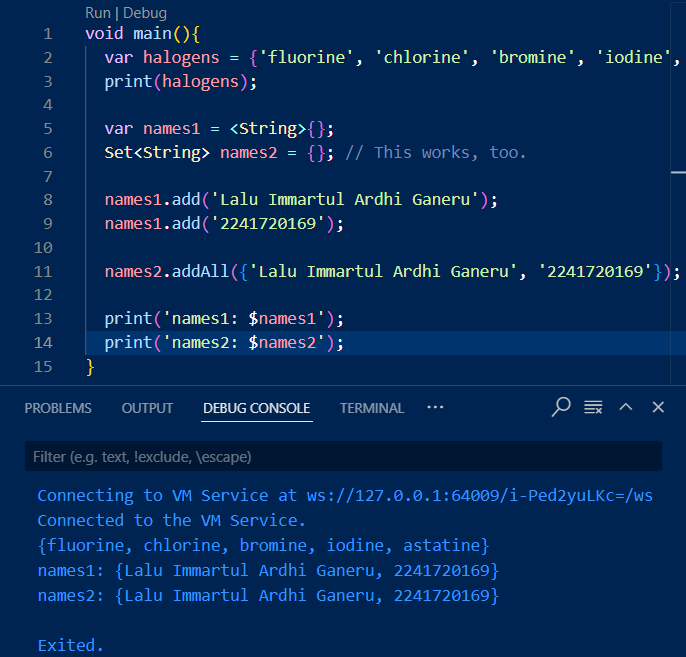
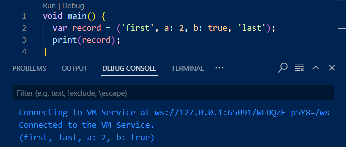

1. Silakan selesaikan Praktikum 1 sampai 5, lalu dokumentasikan berupa screenshot hasil pekerjaan Anda beserta penjelasannya!
    - Praktikum 1
    
    pada kode diatas, program menginialisasi sebuah list yang memiliki 3 elemen yaitu 1, 2, dan 3. kemudian program melakukan print panjang list yang hasilnya 3 dan melakukan print elemen index ke-1 yang hasilnya 2.kemudian program merubah elemen index ke-1 menjadi 1 lalu melakukan print.
    Modifikasi untuk mencetak nama dan nim.
    
    - Praktikum 2
    
    pada percobaan diatas, program melakukan print untuk isi array halogens.
    
    kode program diatas mengeluarkan output 3 array yang masih kosong.
    
    kode program menunjukkan 2 cara yang berbeda untuk menambahkan data ke dalam set, add digunakan untuk menambah data satu persatu, addAll digunakan untuk menambahkan banyak data sekaligus.
    - Praktikum 3
    
    kode program menunjukkan penggunaan map yang dimana data dapat memiliki key dan value.
    
    kode program merubah nilai gifts dengan key fifth menjadi 'golden rings', dan nilai nobleGases dengan key 18 menjadi 'argon'. kode juga membuat dua map kosong yaitu mhs1 dan mhs2
    Modifikasi untuk menambahkan nama dan nim untuk tiap variabel
    
    -Praktikum 4
    
    kode diatas menampilkan isi dari list1 yaitu 1, 2, dan 3, lalu menampilkan isi dari list2 yaitu 0 ditambah dengan isi list1 sehingga menjadi 0, 1, 2, 3. dan terakhir menampilkan panjang list2 yaitu 4.
    
    menambahkan kode untuk merubah nilai index ke-3 dari list1 menjadi null dan menginisialisasi list3 dan menambahkan nilai list1 ke list3.
    
    modifikasi diatas menambahkan nim pada list.
    
    pada kedua program diatas, kode akan menampilkan outlet ketika promoActive bernilai true.
    
    Ketika login memiliki nilai manager, maka output akan memiliki inventory. Ketika login bukan bernilai Manager dalam kasus ini employee inventory tidak akan keluar pada output
    
    kode program membuat variabel listOfStrings dengan menggunakan listOfInts dan collection for dimana isi dari listOfInts ditambah # akan menjadi isi dari listOfStrings. Collection for digunakan untuk melakukan perulangan.
    - Praktikum 5
    
    kode menampilkan isi variable record yang dimana elemen yang tidak memiliki label akan ditampilkan terlebih dahulu
    
    ketika fungsi tukar di jalankan, isi swapped menjadi isi dari record yang ditukar
    
    kode program mengeluarkan record mahasiswa yang memiliki format(String, int)
    
    kdoe program mengeluarkan output isi dari mahasiswa2. saat memanggil last, kode menggunakan $2 karena last adalah elemen kedua yang tidak memiliki label.
    Modifikasi record
    
2. Jelaskan yang dimaksud Functions dalam bahasa Dart!
    function adalah blok kode yang berada di luar main dan dapat dipanggil untuk melakukan operasi.
3. Jelaskan jenis-jenis parameter di Functions beserta contoh sintaksnya!
    a. Positional Parameters: parameter yang harus diisi sesuai urutan deklarasi
        void test(String data1, int data2){}
    b. Optional Positional Parameters: parameter yang bersifat opsional
        void test(String data1, [int? data2]){}
    c. Named Parameters: parameter yang disebutkan namanya ketika dipanggil
        void test({String? data1, int? data2}){}
    d. Required Named Parameters: Named parameters yang wajib diisi
        void test({required String data1, required int data2}){}
    e. Default Values: parameter yang memiliki nilai default
        void test({String data1 = '1', int data2 = 0}){}
4. Jelaskan maksud Functions sebagai first-class objects beserta contoh sintaknya!
    function sebagai first-class objects berarti bahwa function bisa disimpan dalam variabel, dilewatkan sebagai parameter ke function lain, atau dikembalikan dari function.
    void main() {
    var sayHello = (String name) {
        print('Hello, $name!');
    };
    
    // Function sebagai parameter
    void executeFunction(Function func, String name) {
        func(name);
    }

    executeFunction(sayHello, 'Immar');  // Output: Hello, Immar!
    }
5. Apa itu Anonymous Functions? Jelaskan dan berikan contohnya!
    Anonymus function adalah function yang tidak memiliki nama
    void main() {
    var numbers = [1, 2, 3, 4];
    
    // Menggunakan anonymous function
    numbers.forEach((num) {
        print(num);  // Output: 1 2 3 4
    });
    }
6. Jelaskan perbedaan Lexical scope dan Lexical closures! Berikan contohnya!
    a. Lexical Scope: variabel yang didefinisikan dalam scope dan hanya dapat diakses di dalam scope tersebut
        void main() {
        int x = 10;

        void printX() {
            print(x);  // x dapat diakses di dalam scope ini
        }

        printX();  // Output: 10
        }
    b. Lexical Closure: function yang mengingat scope di mana function itu dideklarasikan
        Function makeAdder(int addBy) {
            return (int i) => i + addBy;  // Membuat closure
        }

        void main() {
            var add5 = makeAdder(5);
            print(add5(10));  // Output: 15
        }
7. Jelaskan dengan contoh cara membuat return multiple value di Functions!
    Mengembalikan banyak nilai bisa dilakukan dengan menggunakan tuple, list, atau map.
    contoh dengan list:
        List<dynamic> getPersonInfo() {
            return ['Immar', 2041720134];  // Mengembalikan list
        }

        void main() {
            var info = getPersonInfo();
            print('Name: ${info[0]}, NIM: ${info[1]}');  // Output: Name: Immar, NIM: 2041720134
        }
